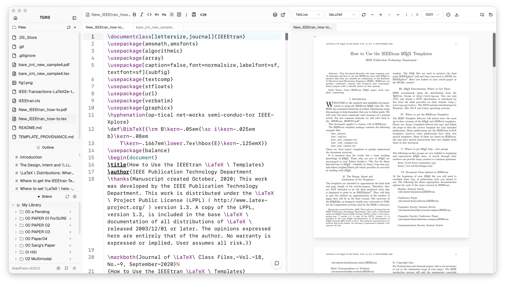
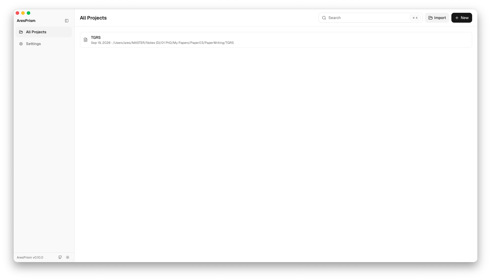
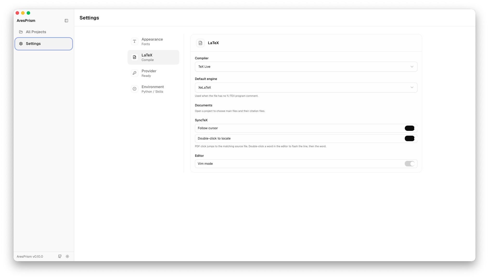
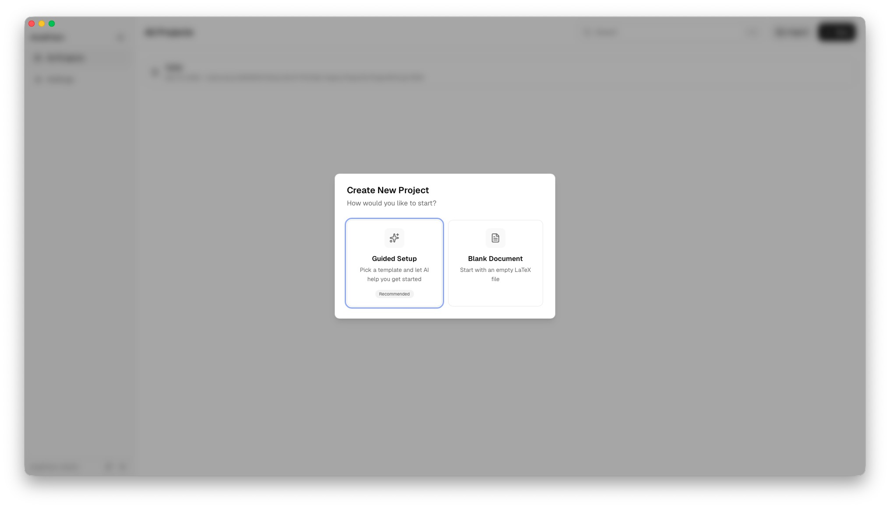
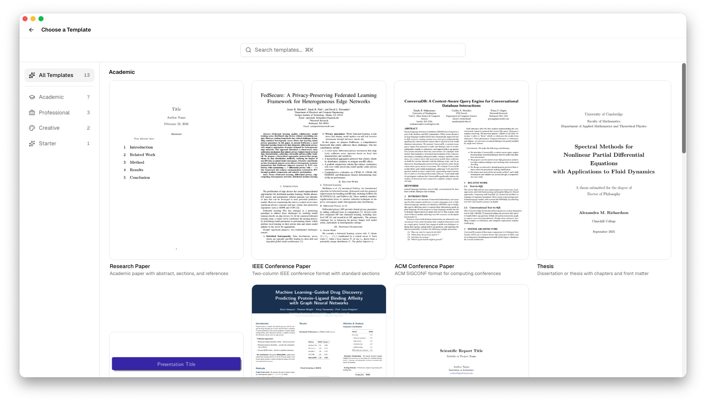
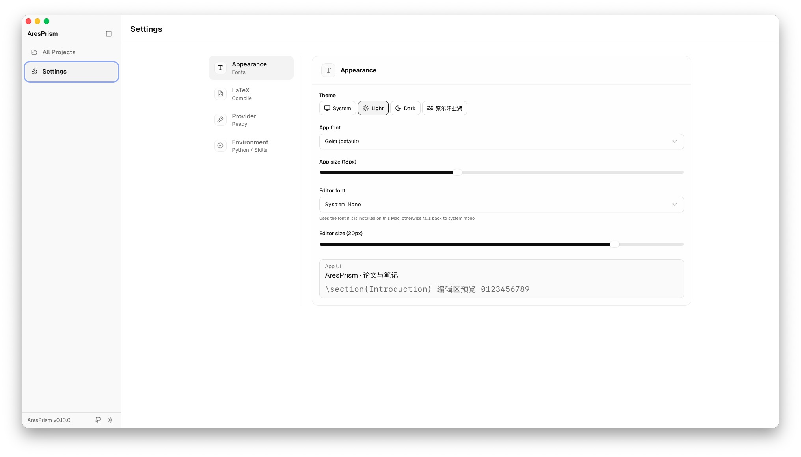
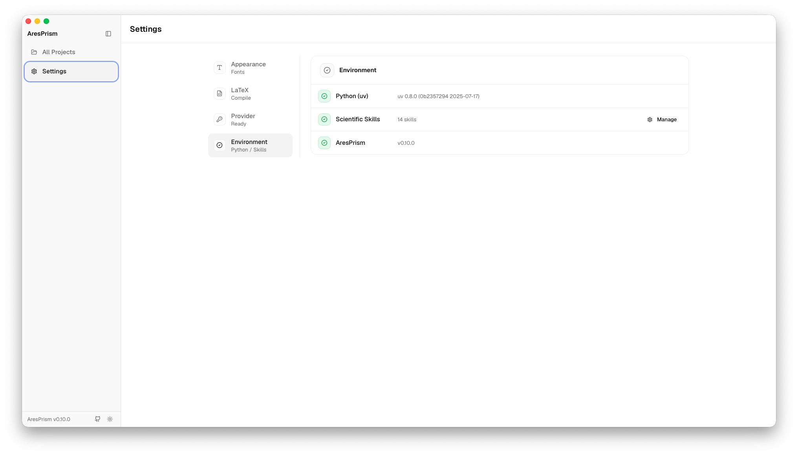

<p align="center">
  
</p>

<h1 align="center">AresPrism</h1>

<p align="center">
  로컬 LaTeX 편집·컴파일 도구.<br/>
  단순한 화면 · 로컬 Zotero · 선택적 AI Agent · 버전 관리.
</p>

<p align="center">
  <a href="./README.md">English</a> ·
  <a href="./README.zh-CN.md">简体中文</a> ·
  <a href="./README.ko.md">한국어</a>
</p>

<p align="center">
  <a href="https://github.com/Ares960826/AresPrism/releases/latest">
    
  </a>
</p>
<p align="center">
  <a href="https://github.com/Ares960826/AresPrism/releases">
    
  </a>
</p>

<p align="center">
  
</p>

AresPrism은 컴퓨터에서 직접 편집하고 컴파일하고 미리보는 **로컬** LaTeX 도구입니다. 방해를 줄이고 원고를 끝내는 데 맞춰져 있습니다. 논문이 우선이고, 노트와 이력서도 됩니다.

## 왜 AresPrism인가?

[OpenAI Prism](https://openai.com/prism/)은 클라우드 작업 공간입니다. [ClaudePrism](https://github.com/delibae/claude-prism)은 Claude 중심의 로컬 글쓰기 앱입니다. AresPrism은 같은 데스크톱 계보에서 시작해 **LaTeX를 제품으로** 두고, AI는 선택으로 둡니다.

| | OpenAI Prism | ClaudePrism | AresPrism |
|---|:---:|:---:|:---:|
| 정체 | 클라우드 LaTeX | Claude + LaTeX + skills | **로컬 LaTeX 편집·컴파일** |
| 실행 | 브라우저 | 네이티브 데스크톱 | **네이티브 데스크톱 (Tauri 2)** |
| 컴파일 | 클라우드 | Tectonic | **Tectonic + TeX Live + latexmk** |
| 엔진 | — | Tectonic | **pdfLaTeX / XeLaTeX / LuaLaTeX** |
| 문헌 | — | Zotero OAuth | **로컬 `zotero.sqlite`** |
| AI | 클라우드 GPT | Claude만 | **선택: Claude, Codex, Grok, Kimi** |
| UI | 클라우드 앱 | 기능이 많음 | **단순, 察尔汗盐湖 포함** |
| 버전 | — | Git 기록 | **편집기 Git 스냅샷** |
| 소스 | 독점 | MIT | **BSL 1.1** (0.7.1 이전 태그는 MIT) |

파일은 디스크에 있습니다. 컴파일은 로컬입니다. 채팅을 열지 않으면 LLM으로 내용이 가지 않습니다.

## 기능

### 편집기와 실시간 PDF

CodeMirror 6, MuPDF, SyncTeX. **⌘ Enter**로 컴파일. 미리보기 막대에서 TeX Live / XeLaTeX.

<p align="center">
  
</p>

### Home

프로젝트를 목록으로 봅니다. **New** 또는 **Import**. 기본 폴더: `~/Documents/AresPrism`.

<p align="center">
  
</p>

### 컴파일러

**설정 → LaTeX**: Tectonic, TeX Live, latexmk. 주 파일을 여러 개 둘 수 있고, 인용 파일은 비워도 됩니다.

<p align="center">
  
</p>

### 로컬 Zotero

사이드바가 이 Mac의 `zotero.sqlite`를 읽습니다. zotero.org를 쓰지 않습니다. `\cite` 삽입, 컬렉션을 `.bib`로 가져오기.

### 템플릿

안내 설정 또는 빈 `.tex`. IEEE / ACM / 학위논문 템플릿이 있습니다.

<p align="center">
  
</p>
<p align="center">
  
</p>

### 선택적 AI Agent

이미 로그인한 Claude Code, Codex, Grok, Kimi를 채팅에 연결할 수 있습니다.

<p align="center">
  
</p>
<p align="center">
  
</p>

## 설치 및 배포

- [中文](docs/ares/install-zh.md) · [English](docs/ares/install-en.md) · [한국어](docs/ares/install-ko.md)

**AI에게 설치를 맡기려면:**

> Read https://github.com/Ares960826/AresPrism/blob/main/docs/ares/agent-install.md and install TeX (if needed) and AresPrism on this Mac, then open the app.

소스 빌드: [CONTRIBUTING.md](CONTRIBUTING.md).

## Windows 기여자를 찾습니다

배포본은 지금 **macOS Apple Silicon**만 있습니다. **Windows** 패키징, TeX Live 경로, 설치 프로그램, 테스트를 맡아 줄 협력자를 구합니다. [Issue](https://github.com/Ares960826/AresPrism/issues) 또는 PR.

## 계보

```
OpenAI Prism       클라우드 제품 (영감만)
      │
Open Prism         assistant-ui / MIT
      ▼
ClaudePrism        delibae / MIT
      ├── ClaudePrism으로 계속
      └── AresPrism   이 저장소
```

상속 코드 작성자: [CREDITS.md](./CREDITS.md).

## 라이선스

**0.8.0**부터 [Business Source License 1.1](./LICENSE). 논문과 노트 작성은 허용됩니다.

업스트림은 [MIT](./LICENSES/MIT.txt). **v0.1.0–v0.7.1** 태그는 MIT입니다.

[Changelog](./docs/ares/CHANGELOG.md)
