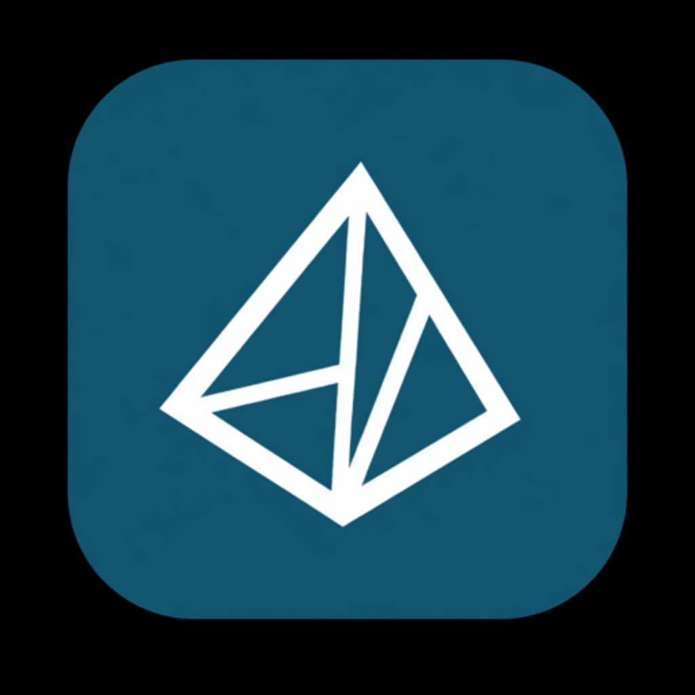

<p align="center">
  
</p>

<h1 align="center">AresPrism</h1>

<p align="center">
  A local LaTeX IDE for research papers, notes, and CVs.<br/>
  Independent product based on <a href="https://github.com/delibae/claude-prism">ClaudePrism</a> (MIT).
</p>

<p align="center">
  <a href="./README.md">English</a> ·
  <a href="./README.zh-CN.md">简体中文</a> ·
  <a href="./README.ko.md">한국어</a>
</p>

<p align="center">
  <a href="https://github.com/Ares960826/AresPrism/releases">
    
  </a>
</p>

This is **not** the official ClaudePrism repository. AresPrism is a **parallel** product in the same open-source family. The first public source is [Open Prism](https://github.com/assistant-ui/open-prism) (assistant-ui, MIT). ClaudePrism built the desktop app from that tree. AresPrism starts from ClaudePrism 1.3.0 and develops separately. Full lineage and contributor names: [CREDITS.md](./CREDITS.md).

## Install (macOS, Apple Silicon)

1. Download the latest `.dmg` from [Releases](https://github.com/Ares960826/AresPrism/releases).
2. Drag **AresPrism** into `/Applications`.
3. It can sit next to official `ClaudePrism.app` (`com.claude-prism.desktop` vs `dev.ares.prism`).

First launch may need **Right-click → Open** if macOS Gatekeeper blocks the ad-hoc signed build.

## What AresPrism changes

- App name **AresPrism**, bundle id `dev.ares.prism`, teal icon
- Compilers: **Tectonic**, **TeX Live**, **latexmk**
- Engines: **pdfLaTeX** (default when there is no `% !TEX program`), LuaLaTeX, XeLaTeX
- MacTeX / TeX Live binary discovery for 2024–2026 and `/Library/TeX/texbin`
- Upstream auto-update **disabled** (this app must never install official ClaudePrism builds)
- Default projects folder: `~/Documents/AresPrism`

Inherited from ClaudePrism: CodeMirror editor, MuPDF preview, SyncTeX, Git snapshots, Zotero, optional Claude chat, templates.

## Develop

```bash
pnpm install
pnpm dev:desktop      # Tauri dev
pnpm build:desktop    # production .app + .dmg
```

See [CONTRIBUTING.md](./CONTRIBUTING.md). Versioning: [docs/VERSIONING.md](./docs/VERSIONING.md).

macOS Tectonic builds on this tree expect Homebrew ICU/HarfBuzz; `pnpm dev:desktop` / `pnpm build:desktop` set `PKG_CONFIG_PATH`, `CPATH`, and `CXXFLAGS=-std=c++17`.

## Version

AresPrism **0.1.0** is the first independent release, based on ClaudePrism **1.3.0**. Changelog: [docs/ares/CHANGELOG.md](./docs/ares/CHANGELOG.md).

## Lineage

```
OpenAI Prism       cloud product (inspiration only, not our source)
      │
Open Prism         assistant-ui / MIT
      │            https://github.com/assistant-ui/open-prism
      ▼
ClaudePrism        delibae / MIT
      │            https://github.com/delibae/claude-prism
      ├── continues as ClaudePrism
      └── AresPrism   this repository
```

AresPrism’s author and the people who wrote the inherited Open Prism / ClaudePrism code are listed in [CREDITS.md](./CREDITS.md). Please do not treat the GitHub “Contributors” graph as that full list.

## License

[MIT](./LICENSE). Copyright (c) 2025 assistant-ui, 2026 delibae, 2026 Ares.
