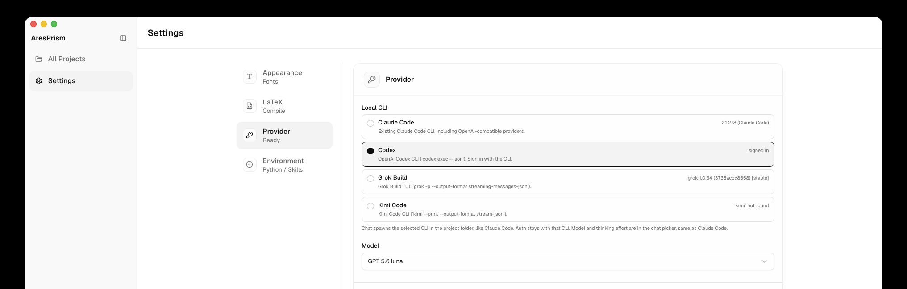

  

<h1 align="center">AresPrism</h1>

  本地 LaTeX 编辑与编译工具。 
  界面简单 · 本机 Zotero · 可接入 AI Agent · 自带版本管理。

  <a href="./README.md">English</a> ·
  <a href="./README.zh-CN.md">简体中文</a> ·
  <a href="./README.ko.md">한국어</a>

  

  

  

AresPrism 是装在自己电脑上的 LaTeX 工具：写、编、预览都在本地。定位是少打扰、把稿子写完——论文优先，也适合笔记和简历。

## 为什么是 AresPrism？

[OpenAI Prism](https://openai.com/prism/) 是云端工作区。[ClaudePrism](https://github.com/delibae/claude-prism) 是以 Claude 为中心的本地写作应用。AresPrism 同源，但把 **LaTeX 当产品**，AI 是可选项。

| | OpenAI Prism | ClaudePrism | AresPrism |
|---|:---:|:---:|:---:|
| 定位 | 云端 LaTeX | Claude + LaTeX + skills | **本地 LaTeX 编辑编译** |
| 运行 | 浏览器 | 原生桌面 | **原生桌面（Tauri 2）** |
| 编译 | 云端 | Tectonic | **Tectonic + TeX Live + latexmk** |
| 引擎 | — | Tectonic | **pdfLaTeX / XeLaTeX / LuaLaTeX** |
| 文献 | — | Zotero OAuth | **本机 `zotero.sqlite`** |
| AI | 云端 GPT | 仅 Claude | **可选：Claude、Codex、Grok、Kimi** |
| 界面 | 云端应用 | 功能密集 | **克制，含察尔汗盐湖** |
| 版本 | — | Git 历史 | **编辑器内 Git 快照** |
| 源码 | 专有 | MIT | **BSL 1.1**（0.7.1 及更早标签仍是 MIT） |

文件在磁盘上。编译在本地。不打开聊天，就不会把内容发给大模型。

## 功能

### 编辑与实时 PDF

CodeMirror 6、MuPDF、SyncTeX。**⌘ Enter** 编译。预览栏可选 TeX Live / XeLaTeX（以及 pdfLaTeX / LuaLaTeX）。

  

### Home

工程以列表显示。**New** 或 **Import**。默认目录：`~/Documents/AresPrism`。

  

### 编译器

**设置 → LaTeX**：Tectonic、TeX Live 或 latexmk。可配对多个主文件；引用文件可以空。

  

### 本机 Zotero

侧栏读本机 `zotero.sqlite`，不走 zotero.org。插入 `\cite`，把集合导入 `.bib`。

### 模板

引导创建或空白 `.tex`。含 IEEE / ACM / 学位论文等模板。

  

  

### 可选 AI Agent

**设置 → Provider**：选用本机已登录的 CLI — Claude Code、Codex、Grok 或 Kimi。

  

## 安装与部署

- [中文](docs/ares/install-zh.md) · [English](docs/ares/install-en.md) · [한국어](docs/ares/install-ko.md)

**让 AI 代装** — 把这句话发给能操作这台电脑的助手：

> 请阅读 https://github.com/Ares960826/AresPrism/blob/main/docs/ares/agent-install.md ，在这台 Mac 上安装 TeX（如需要）和 AresPrism，装好后打开应用。

从源码编译：[CONTRIBUTING.md](CONTRIBUTING.md)。

## 招募 Windows 开发合作者

目前发布包只有 **macOS Apple Silicon**。需要有人一起做 **Windows** 的打包、TeX Live 路径、安装程序和测试。请开 [Issue](https://github.com/Ares960826/AresPrism/issues) 或 PR。

## 许可

从 **0.8.0** 起为 [Business Source License 1.1](./LICENSE)。写论文、做笔记可以。不能拿本仓库去做竞品桌面 LaTeX IDE。到 **2029-09-19**（或该版本首次发布满四年，以较早者为准）变为 Apache-2.0。

上游部分仍是 [MIT](./LICENSES/MIT.txt)。**v0.1.0–v0.7.1** 标签仍按 MIT。

[变更](./docs/ares/CHANGELOG.md)

## 致谢

AresPrism 的代码血统如下。他们是这一脉的创始人和此前的重要贡献者。

- [Open Prism](https://github.com/assistant-ui/open-prism)，[assistant-ui](https://github.com/assistant-ui) — 这一脉最早的公开源码，浏览器里的 LaTeX 工作区（MIT）。OpenAI Prism 是另一款云端产品，不是源码来源。
- [ClaudePrism](https://github.com/delibae/claude-prism)，[Hanjin Bae](https://github.com/delibae)（`delibae`）— 把 Open Prism 做成带本地编译和 Claude 的桌面应用。AresPrism 从 ClaudePrism **1.3.0** 快照（`674e7c7`）起步。

ClaudePrism 仍在独立发展。AresPrism 是平行产品，不是官方 ClaudePrism。

完整名单见 [CREDITS.md](./CREDITS.md)。
